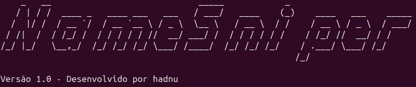

# NameSniper - OSINT Reconnaissance Tool

[](https://golang.org/)
[](https://www.apache.org/licenses/LICENSE-2.0)



**NameSniper** is a lightweight, command-line OSINT (Open-Source Intelligence) tool written in Go, designed for the reconnaissance phase of ethical hacking and security research.

## MVP Limitations
⚠️ **Note**: This is an early MVP (Minimum Viable Product) version of NameSnipe. As such, it has some limitations:
- **Single API Support**: Currently relies only on the Google Custom Search API (100 free queries/day limit).
- **Basic Parsing**: Extracts titles, URLs, and snippets, but lacks advanced parsing for emails, usernames, or other identifiers.
- **No Multi-Source Queries**: Limited to one data source at a time; future versions will integrate additional APIs (e.g., Twitter).
- **Input Format**: Accepts only names via CLI; file-based input (e.g., CSV) is planned but not yet implemented.

Feedback and contributions are welcome to help evolve this tool!

---
### Key Features

- **Flexible Input:** Search using a first name and optional last name via CLI arguments.

- **API Integration:** Currently supports Google Custom Search JSON API with a daily query limit tracker (100 free queries/day).

- **Query Limit Management:** Tracks usage and enforces the free tier limit, resetting daily.

- **Extensible Design:** Built with modularity in mind for easy addition of new data sources (e.g., Twitter, GitHub).

- **Timeout Handling:** Configurable HTTP timeout to prevent hangs during API requests.

## Installation

1. Install Go: `sudo apt install golang`
2. Install godotenv: `go get github.com/joho/godotenv`
3. Clone the repo: `git clone https://github.com/had-nu/namesniper.git`
4. Set environment variables in `.env` or via `export`
5. Run: `go run main.go "FirstName LastName"`

## Usage
```bash
export GOOGLE_API_KEY="your_api_key_here"
go run main.go "FirstName LastName"
```

## Planned Enhancements

- Integration with additional APIs (e.g., Twitter)
- Support for input files (e.g., CSV with names, emails, phones)
- Advanced parsing for emails, social media handles, and other identifiers

Contributions welcome! :)

---

### Licença Apache 2.0

