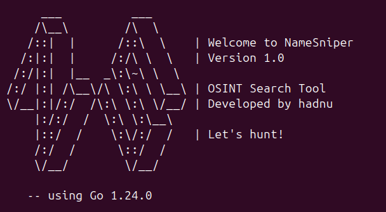

# NameSniper - OSINT Search Tool



[](https://golang.org/)
[](https://www.apache.org/licenses/LICENSE-2.0)

<a href="https://www.buymeacoffee.com/hadnu">
  
</a>

**NameSniper** is a lightweight, command-line OSINT (Open-Source Intelligence) tool written in Go, designed for the reconnaissance phase of ethical hacking and security research. This is a tool that uses the Google Search API to look up information about people's names.

**Ethical Hacking Disclaimer**

NameSniper is built for educational, ethical, and legal use only. Ethical hacking requires explicit permission from the system or data owner—full stop. Unauthorised use to access, collect, or manipulate data without consent is illegal and carries serious legal, financial, and ethical consequences.

This MVP stems from my cybersecurity journey, aiming to support the OSINT community and inspire learners while promoting reconnaissance best practices. It’s open for collaboration, but use it responsibly in authorised settings only. My intent is to empower security pros and students, not enable misuse.

See the Code of Conduct file.

---

## MVP Limitations
⚠️ **Note**: This is an early MVP (Minimum Viable Product) version of NameSnipe. As such, it has some limitations:
- **Single API Support**: Currently relies only on the Google Custom Search API (100 free queries/day limit).
- **Basic Parsing**: Extracts titles, URLs, and snippets, but lacks advanced parsing for emails, usernames, or other identifiers.
- **No Multi-Source Queries**: Limited to one data source at a time; future versions will integrate additional APIs (e.g., Twitter).
- **Input Format**: Accepts only names via CLI; file-based input (e.g., CSV) is planned but not yet implemented.

Feedback and contributions are welcome to help evolve this tool!

---

## Estrutura do Projeto
```text
NameSniper/
├── bin/                    # Compiled binaries
│   └── goNameSniper        # Executable generated by go build
├── cmd/                    # Command-line entry points
│   └── goNameSniper/       # Main application directory
│       └── main.go         # Entry point of the NameSniper CLI tool
├── doc/                    # Compiled binaries
│   └── feats.text          # Log of new features
├── internal/               # Private application code
│   ├── config/             # Configuration handling
│   │   └── config.go       # Loads environment variables from .env
│   ├── search/             # Search-related business logic
│   │   └── search.go       # Handles Google API queries and result parsing
│   ├── counter/            # Query limit management and persistence
│   |   ├── counter.go      # Manages daily query limits
│   |   └── persist.go      # Persists query counter to/from consultas.json
|   └── ui/                 # Cosmetic adjustments
|       └── banner.go       # Program's Brand
├── .env                    # Environment configuration file (not tracked)
├── querylog.json           # Query history file (not tracked)
├── go.mod                  # Go module definition
├── go.sum                  # Dependency checksums
├── LICENSE                 # Project license
├── README.md               # Project documentation and usage instructions
└── .gitignore              # Git ignore patterns (e.g., .env, bin/)
```

---
### Key Features

- **Flexible Input:** Search using a first name and optional last name via CLI arguments.

- **API Integration:** Currently supports Google Custom Search JSON API with a daily query limit tracker (100 free queries/day).

- **Query Limit Management:** Tracks usage and enforces the free tier limit, resetting daily.

- **Extensible Design:** Built with modularity in mind for easy addition of new data sources (e.g., Twitter, GitHub).

- **Timeout Handling:** Configurable HTTP timeout to prevent hangs during API requests.

## Installation

1. Install Go: `sudo apt install golang`
2. Install godotenv: `go get github.com/joho/godotenv`
3. Clone the repo: `git clone https://github.com/had-nu/NameSniper.git`
4. Set environment variables in `.env` or via `export` in te root

### Setup
```bash
export	GOOGLE_API_KEY=your_key
  	GOOGLE_CX=your_cx
  	GOOGLE_URL=https://www.googleapis.com/customsearch/v1
```

### Build and Run
```bash
go build -o bin/goNameSniper ./cmd/goNameSniper
./bin/goNameSniper
```

## Planned Enhancements

- Integration with additional APIs (e.g., Twitter)
- Support for input files (e.g., CSV with names, emails, phones)
- Advanced parsing for emails, social media handles, and other identifiers

Contributions welcome! :)

---

## Licença
Este projeto está licenciado sob a **Apache License 2.0**. Consulte o arquivo [LICENSE](LICENSE) para mais detalhes.

[](https://opensource.org/licenses/Apache-2.0)

